<!--
  Palette derived from profile portrait:
    magenta  #E91E63
    cyan     #00BCD4
    accent   #FF1F8E
    canvas   #0D1117
    text     #F8F8F2
-->

<p align="center">
  
</p>

<p align="center">
  
</p>

<p align="center">
  <a href="https://www.uiam.sk/~wadinger/"></a>
  <a href="https://scholar.google.com/citations?user=MarekWadinger"></a>
  <a href="https://www.linkedin.com/in/marek-wadinger/"></a>
  
</p>

---

## About me

```yaml
name:         Marek Wadinger
role:         PhD Candidate · Slovak University of Technology (SWAN)
located_in:   Slovakia
working_on:
  - AIOperator         # agentic AI for industrial monitoring & diagnosis
  - dissertation       # Safety-First Control and Monitoring for Industrial Systems
collaborating_on:
  - online-ml/river    # online machine learning
  - CPCLAB-UNIPI/SIPPY # system identification
ask_me_about:
  - online machine learning
  - control theory & optimization
  - interpretable / explainable AI
fun_fact:    "I write Python by day and MATLAB package managers by night."
```

---

## Featured work

<table>
  <tr>
    <td width="50%" valign="top">
      <a href="https://github.com/MarekWadinger/adaptive-interpretable-ad">
        
      </a>
      <p align="center">
        <a href="https://doi.org/10.1016/j.eswa.2024.123200"></a>
        
        
      </p>
    </td>
    <td width="50%" valign="top">
      <a href="https://github.com/MarekWadinger/tf2ss">
        
      </a>
      <p align="center">
        <a href="https://pypi.org/project/tf2ss/"></a>
        
        
      </p>
    </td>
  </tr>
  <tr>
    <td width="50%" valign="top">
      <a href="https://github.com/MarekWadinger/tbxmanager">
        
      </a>
      <p align="center">
        
        
        
      </p>
    </td>
    <td width="50%" valign="top">
      <a href="https://github.com/MarekWadinger/ai-operator">
        
      </a>
      <p align="center">
        
        
        
      </p>
    </td>
  </tr>
</table>

<p align="center">
  Also contributing to&nbsp;
  <a href="https://github.com/online-ml/river"><b>river</b></a> ·
  <a href="https://github.com/CPCLAB-UNIPI/SIPPY"><b>SIPPY</b></a> ·
  <a href="https://github.com/MarekWadinger/python-app-template"><b>python-app-template</b></a>
</p>

---

## Toolbox

<p align="center">
  
  
  
  
  
  <br/>
  
  
  
  
  
  <br/>
  
  
  
  
  
</p>

---

## The numbers

<p align="center">
  
  
</p>

<p align="center">
  
</p>

<p align="center">
  
</p>

---

<p align="center">
  <i>Built at the intersection of <b>research</b> and <b>industry</b> &mdash; let's talk.</i>
</p>

<p align="center">
  
</p>
